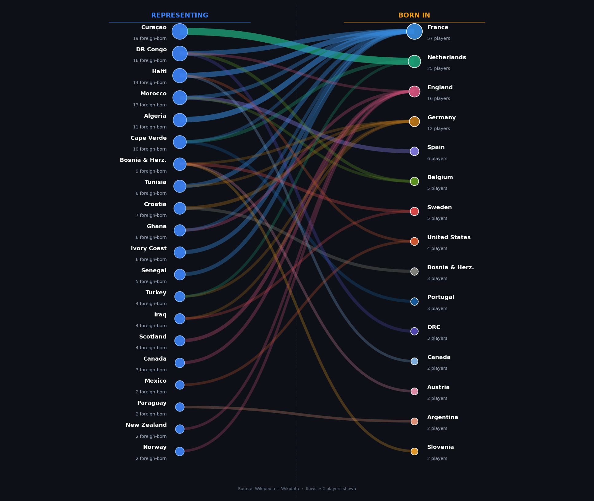
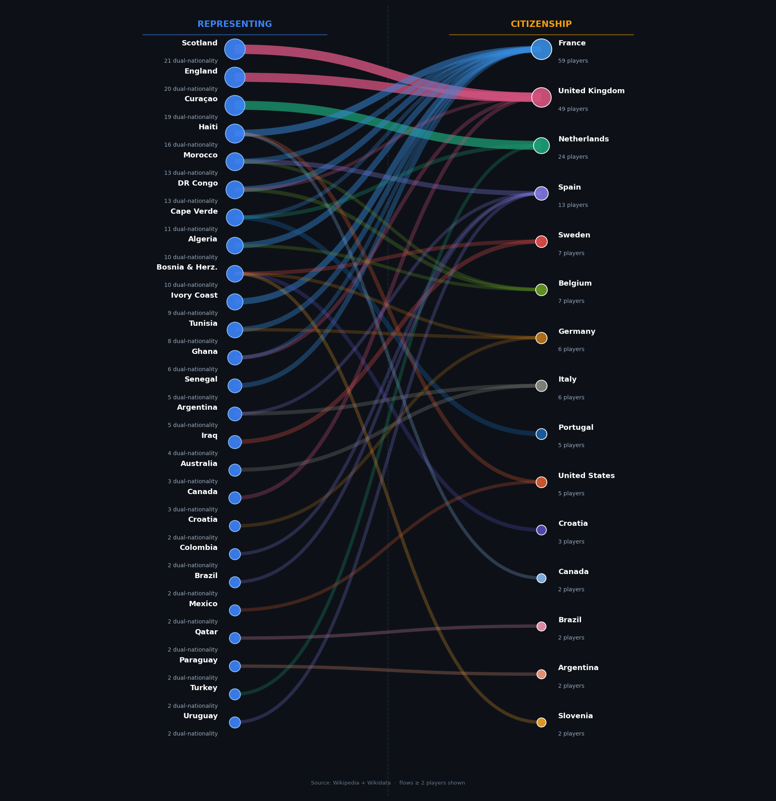

# Born Here, Playing There: FIFA Nationality Paradox

As I watched FIFA World Cup Soccer game after game I could not help but wonder why many players do not appear to belong to the country they are playing for. This is a delicate and politically fraught subject. Moreover, as an immigrant to the US, how dare I stereotype. Nevertheless, I couldn’t help myself, so I dug deeper. With assistance from Claude Sonnet 4.6, I gathered Football player data from Football API and inferred player country of birth and citizenship from crawling through their Wikipedia pages. The result was a collection of 1248 players from 52 playing nations with 24 in each team. Birth country was not available for 315 players and citizenship was not available for 308 so we have complete data on 933 (or 75%) players.

The data revealed a striking pattern:
- 213 (or 23%) are playing for a country different from their birth country.
- 283 (or 30%) are either dual citizens or meet FIFA requirements to play for another country.

FIFA rules allow a player to represent a specific country if they meet at least one of the following four conditions: born there, parents or grandparents were born there, or player has lived there continuously for at least five years. When the option is available players tend to choose the country that gives them the best shot of playing in the World Cup. Good for the players but to the country it may look like they are exporting talent! So, here is a look at Exporters and Importers of Talent. For an interactive version, click on the link below the chart.

## Visualizations

### Crossing Borders: Born in One Country, Representing Another

### Citizenship Paradox: Citizenship of One Country, Representing Another

## Interactive Versions (GitHub Pages)
You can view the interactive, hoverable versions of these charts directly in your browser:
* [Interactive Migration Flow Chart](https://pseudorational.github.io/fifa-nationality-paradox/wc2026_migration.html)
* [Interactive Citizenship Flow Chart](https://pseudorational.github.io/fifa-nationality-paradox/wc2026_citizenship.html)
